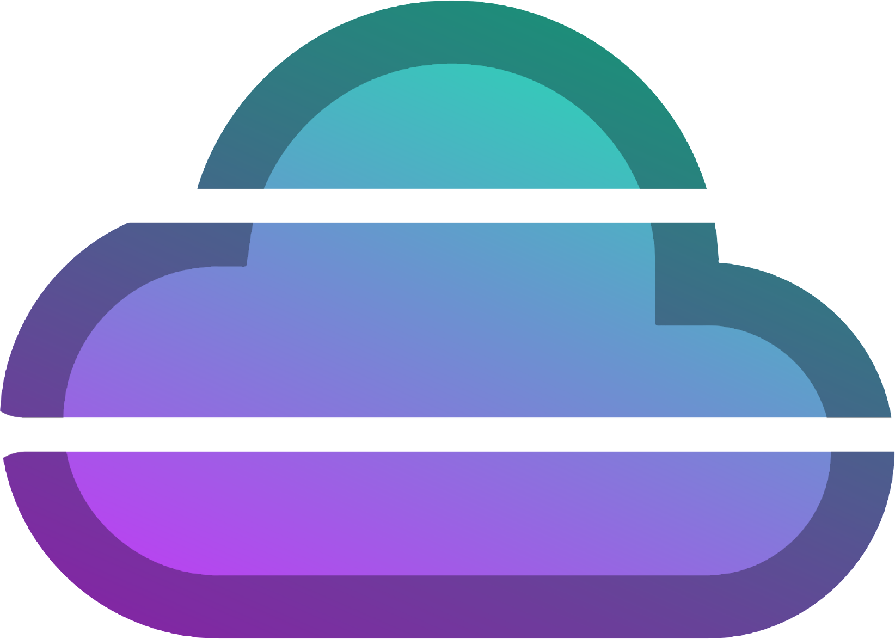

# SolDrive

An on-chain cloud storage with encryption and file manager on Solana

[](https://github.com/coral-xyz/anchor)

<div align="center">
  
</div>


SolDrive is completely on-chain note & file drive storage on [solana](https://solana.com/). A chain managed file manager allows for organizing files and folder.

## Notes

Fully on-chain notes can be added, with or without encryption. 

## Files

It gets expensive to store large files to the blockchain. Files can be uploaded to the cloud as well using [filecoin](https://filecoin.io/).

## Folders

Folders may be created to organise notes & files in a clean hierachy

# Build

Run the tests

```bash
cd anchor
anchor test
```

Build & deploy the contract

```bash
anchor build 
anchor deploy
```

```bash
Run a local validator on localhost:8899
solana-test-validator
```

Run the client

```bash
yarn install
yarn dev
```

