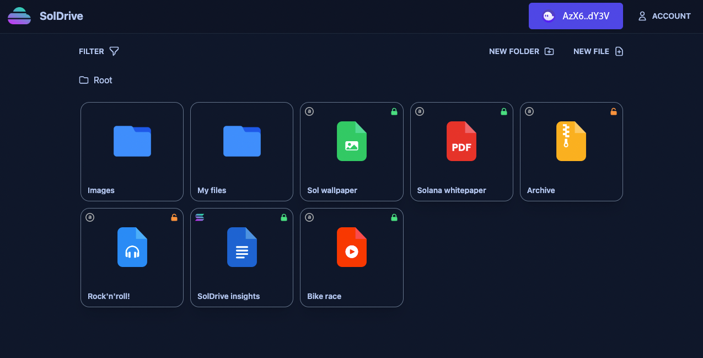

# SolDrive

An on-chain cloud storage with encryption and file manager on Solana

[](https://solana.com/)
[](https://github.com/coral-xyz/anchor)
[](https://soldrive.xyz)

<div align="center">
  
</div>

SolDrive is completely on-chain cloud storage platform on [Solana](https://solana.com/), featuring a file manager to organise files and folders, a text editor to easily edit text files and take notes, as well as several file viewers to explore the stored files directly online.

## Give it a try!

SolDrive is accessible online at [soldrive.xyz](https://soldrive.xyz)

## Backends

Files and notes can be stored both on-chain directly Solana Accounts, or on [Arweave](https://www.arweave.org/), a specialised file chain, to drastically reduce the uploading cost. Links to those files are then maintained on chain. Regardless of the backend chosen, the hosting is paid once on a data size basis and the data lives forever.

<div align="center">
  
</div>
<div align="center">
  
</div>

## Encryption

All the assets are encrypted by default using a key derived from a Solana Wallet. No need to remember yet another password. Assets can also be shared unencrypted with read and edit rights for collaborative text editing (feature coming soon).

<div align="center">
  
</div>

## File support

Any file can be stored, and several file types can be opened directly on Soldrive, including text documents, images, videos, audio files and PDFs. A built-in note editor enables online notes edition.

## File manager

<div align="center">
  
</div>

# Build & run

Run the tests

```bash
cd anchor
anchor test
```

Run a local validator on localhost:8899

```bash
solana-test-validator
```

Build & deploy the contract

```bash
anchor build 
anchor deploy
```

Run the client

```bash
yarn install
yarn dev
```


<!-- Feedback -->
<!-- Hover on tooltip  -->
<!-- Drag drop -->
<!--  -->